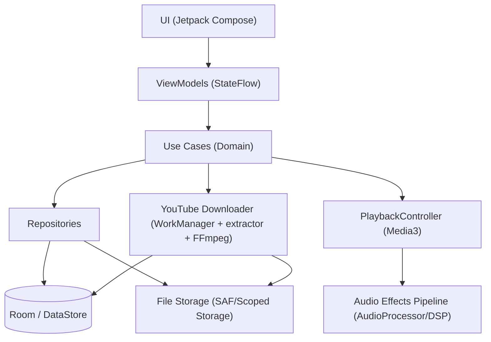

## 1. Resumen Ejecutivo

El proyecto es una app móvil enfocada a reproducir podcasts/audio **100% local y offline**, pensada para usuarios que ya tienen archivos `.mp3` en el dispositivo o que quieren **convertir audio de YouTube a `.mp3`** para escucharlo como podcast. La experiencia clave es un **reproductor cómodo** (botones grandes, saltos 30s/10s, carátula, velocidad) y funciones avanzadas: **marcadores** (segmentos con inicio/fin/nombre) y **procesamiento de audio** (reducción de ruido, realce de voz y salto de silencios).

La aproximación recomendada es una **app Android nativa (Kotlin)** con **arquitectura Clean + MVVM**, almacenamiento local (Room) y reproducción con **Media3/ExoPlayer** en un **Foreground Service** para asegurar continuidad con pantalla apagada. Para efectos de audio, usar **AudioProcessor** (Media3) y/o una capa DSP (TarsosDSP/implementación propia), con una estrategia de “modo exclusivo” para *reducción de ruido* vs *realce de voz*, y un “toggle” adicional para *skip silence*.

El mayor trade-off es funcionalidad avanzada vs consumo de CPU/batería: reducción de ruido y realce de voz en tiempo real pueden ser costosos y variar por dispositivo. Otro trade-off importante es **YouTube → MP3**: es una funcionalidad sensible (términos legales, cambios de endpoints, roturas frecuentes). Para mantener el “sin backend”, se recomienda implementar la descarga como **módulo local opcional** (con fallback) y separar claramente el núcleo offline del módulo YouTube.

Riesgos críticos: (1) **YouTube extraction** puede romperse o ser bloqueada; (2) **DSP en tiempo real** puede degradar rendimiento/latencia; (3) compatibilidad con permisos/almacenamiento (Scoped Storage) y reproducción en background en Android moderno. Se mitigan con aislamiento modular, pruebas en matriz de dispositivos y degradación elegante de funciones.

---

## 2. Requisitos

### 2.1 Requisitos Funcionales

- **[MUST]** Reproducir archivos de audio locales (principalmente `.mp3`) almacenados en el dispositivo y/o importados a la app.
- **[MUST]** Operar offline: toda la biblioteca, metadatos y reproducción deben funcionar sin conexión.
- **[MUST]** Proveer un reproductor con controles grandes: play/pause, salto atrás 30s y adelante 10s.
- **[MUST]** Mostrar carátula/portada del audio y nombre/título en la UI del reproductor.
- **[MUST]** Permitir cambiar la velocidad de reproducción.
- **[MUST]** Permitir crear marcadores/segmentos con **inicio, fin y nombre personalizado** asociados a un archivo.
- **[MUST]** Permitir descargar audio desde un link de YouTube y guardarlo como `.mp3` dentro de la app con portada y nombre.
- **[MUST]** Aplicar efectos/modos de escucha:
  - **[MUST]** Reducción de ruido (modo exclusivo).
  - **[MUST]** Realce de voces (modo exclusivo).
  - **[MUST]** Saltar silencios/pausas (toggle on/off combinable con los anteriores).
- **[SHOULD]** Gestionar biblioteca local (listar, buscar/filtrar, ordenar por recientes, etc.).
- **[SHOULD]** Recordar progreso de reproducción por archivo (posición, última reproducción).
- **[SHOULD]** Soportar reproducción en segundo plano con notificación multimedia y controles desde lockscreen.
- **[NICE]** Permitir editar/eliminar marcadores y exportarlos/importarlos.
- **[NICE]** Soportar más formatos (m4a/aac/ogg) además de mp3.
- **[NICE]** Detectar automáticamente metadatos (ID3) y carátulas embebidas.

### 2.2 Requisitos No Funcionales

- **[MUST]** Compatibilidad Android (dispositivos actuales) y cumplimiento de restricciones de reproducción en background (Foreground Service).
- **[MUST]** Rendimiento estable: reproducción sin cortes; latencia aceptable al activar efectos.
- **[MUST]** Bajo consumo de batería/CPU en reproducción normal; efectos deben degradar lo mínimo posible.
- **[MUST]** Persistencia local robusta (no perder marcadores/progreso ante cierres o reinicios).
- **[MUST]** Privacidad: no subir audios del usuario a servidores; procesamiento local.
- **[MUST]** Manejo seguro de permisos (lectura de medios, notificaciones) bajo Scoped Storage.
- **[SHOULD]** Usabilidad: UI simple “tipo podcast”, accesible (tamaños grandes, contraste, soporte para TalkBack).
- **[SHOULD]** Resiliencia ante fallos en YouTube: mensajes claros, reintentos, cancelación y recuperación.
- **[SHOULD]** Mantenibilidad: modularizar reproducción, almacenamiento y YouTube para evolución independiente.
- **[NICE]** Observabilidad local: logging estructurado (sin telemetría cloud), modo debug para diagnósticos.

---

## 3. Stack Tecnológico

### Mobile App (Android): Kotlin + Jetpack Compose
- **Justificación**: App Android-first, UI de reproductor con controles grandes y estados reactivos; Compose acelera iteración de UI.
- **Pros**:
  - UI declarativa, fácil de mantener.
  - Integración con Jetpack (Lifecycle, ViewModel, Navigation).
  - Buen soporte para animaciones/gestos del reproductor.
- **Contras**:
  - Curva de aprendizaje si el equipo viene de XML.
  - Algunas librerías legacy requieren puentes.
- **Alternativas consideradas**: XML Views, Flutter, React Native.

### Arquitectura App: Clean Architecture + MVVM (ViewModel) + Use Cases
- **Justificación**: Separar núcleo offline (dominio) de infraestructura (Media3, Room, YouTube), reduciendo acoplamiento.
- **Pros**:
  - Testeabilidad (use cases puros).
  - Modularización clara (player, library, youtube).
- **Contras**:
  - Más “boilerplate” que una app simple.
- **Alternativas consideradas**: MVVM “simple”, MVI/Redux.

### Reproducción de Audio: AndroidX Media3 (ExoPlayer) + MediaSession
- **Justificación**: Estándar de facto en Android para audio robusto, background playback, notificaciones y lockscreen.
- **Pros**:
  - Reproducción estable y flexible.
  - MediaSession/Notification integradas.
  - Soporte de AudioProcessors para pipeline de audio.
- **Contras**:
  - Algunos DSP avanzados no vienen “out of the box”.
- **Alternativas consideradas**: Android MediaPlayer, VLC SDK.

### Procesamiento de Audio (DSP): Media3 AudioProcessor + (opcional) TarsosDSP / implementación nativa
- **Justificación**: Permite insertar procesamiento en pipeline; TarsosDSP ayuda con análisis (energía/silencio) y filtros.
- **Pros**:
  - Implementación incremental: primero *skip silence*, luego filtros más complejos.
  - Se puede degradar por dispositivo (feature flags).
- **Contras**:
  - Reducción de ruido/realce de voz “de calidad” requiere tuning y puede consumir CPU.
- **Alternativas consideradas**: Oboe/AAudio + DSP nativo, Superpowered (comercial), WebRTC AudioProcessing (complejo de integrar en playback).

### Base de Datos Local: Room (SQLite)
- **Justificación**: Guardar biblioteca importada, metadatos, progreso, marcadores, estado de descarga.
- **Pros**:
  - Migraciones y queries tipadas.
  - Integración con Kotlin Flow.
- **Contras**:
  - Requiere diseño de esquema y migraciones.
- **Alternativas consideradas**: Realm, SQLDelight, DataStore (solo key-value).

### Almacenamiento de Archivos: Scoped Storage (MediaStore + App-specific storage)
- **Justificación**: Android moderno restringe acceso; conviene almacenar descargas en directorio de app y registrar metadatos.
- **Pros**:
  - Cumple políticas Android.
  - Menos fricción de permisos si se usa almacenamiento propio.
- **Contras**:
  - Importar desde “Downloads” requiere flujos SAF (Storage Access Framework).
- **Alternativas consideradas**: Acceso directo a filesystem legacy (no recomendado), sólo MediaStore.

### Descarga YouTube → MP3 (Local): yt-dlp embebido / extractor basado en NewPipe + FFmpeg (mobile)
- **Justificación**: Sin backend; requiere extracción de stream + transcodificación/merging a mp3.
- **Pros**:
  - Independencia de infraestructura cloud.
  - Se puede ejecutar en WorkManager.
- **Contras**:
  - Fragilidad ante cambios en YouTube.
  - Consideraciones legales/ToS según jurisdicción y distribución (Play Store).
  - FFmpeg aumenta tamaño APK/AAB.
- **Alternativas consideradas**: Backend propio (descarga server-side), abrir link en app externa, sólo soportar URLs directas a audio.

### Background Tasks: WorkManager
- **Justificación**: Descargas y transcodificación deben ser resilientes (pausa/reintento) y respetar restricciones.
- **Pros**:
  - Reintentos, constraints, ejecución confiable.
- **Contras**:
  - No ideal para tareas ultra-tiempo-real; requiere diseño de progreso.
- **Alternativas consideradas**: ForegroundService para descarga, JobScheduler directo.

### Autenticación: No aplica (offline)
- **Justificación**: No hay cuentas ni backend.
- **Pros**:
  - Simplicidad, privacidad.
- **Contras**:
  - Sin sync multi-dispositivo.
- **Alternativas consideradas**: Sign-in con Google + sync (fuera de alcance).

### CI/CD: GitHub Actions + Gradle + Fastlane (opcional)
- **Justificación**: Build/test/lint automáticos, generación de APK/AAB para testers.
- **Pros**:
  - Pipeline reproducible.
  - Automatiza versionado y releases internos.
- **Contras**:
  - Config inicial.
- **Alternativas consideradas**: Bitrise, GitLab CI, Jenkins.

### Distribución: Google Play (Internal testing) + APK side-load
- **Justificación**: App Android; posibilidad de distribuir fuera de Play si YouTube feature entra en conflicto con políticas.
- **Pros**:
  - Canales de testing y control de versiones.
- **Contras**:
  - Políticas Play pueden restringir descarga de YouTube.
- **Alternativas consideradas**: F-Droid, distribución privada (MDM), Huawei AppGallery.

---

## 4. Arquitectura

### 4.1 Patrón Arquitectónico

**Monolito modular (Android app) con Clean Architecture + MVVM.**  
Encaja porque no hay backend ni servicios distribuidos: toda la complejidad está en el cliente (reproductor, DSP, storage, descargas). Un monolito modular permite aislar dominios (Player, Library, YouTube) y reducir riesgos: si el módulo YouTube falla o no es publicable, el core offline sigue funcionando. Escala bien para un equipo pequeño/mediano y un roadmap incremental (primero reproducción + biblioteca, luego marcadores, luego efectos, luego YouTube).

### 4.2 Componentes del Sistema

- **UI App** (Jetpack Compose): Pantallas (biblioteca, reproductor, marcadores, ajustes). Se comunica con: ViewModels.
- **Presentation Layer** (ViewModel + StateFlow): Orquesta estados de UI, comandos de reproducción, acciones de marcadores. Se comunica con: Use Cases, Playback Controller.
- **Domain Layer (Use Cases)** (Kotlin): Reglas de negocio (importar, crear marcador, cambiar modo, persistir progreso). Se comunica con: Repositories/Interfaces.
- **Playback Engine** (Media3 ExoPlayer + MediaSession): Reproduce audio, expone controles, maneja audio focus. Se comunica con: Audio Effects Pipeline, Storage.
- **Audio Effects Pipeline** (Media3 AudioProcessor + DSP libs): Implementa reducción de ruido / realce voz / skip silence. Se comunica con: Playback Engine.
- **Local Data Store** (Room + DataStore): Guarda episodios/archivos, marcadores, progreso, settings. Se comunica con: Domain/Repositories.
- **File Storage Manager** (Scoped Storage / SAF / MediaStore): Importa/guarda mp3, extrae metadatos y portada. Se comunica con: Domain, YouTube Downloader.
- **YouTube Downloader** (WorkManager + extractor + FFmpeg): Descarga/convierte audio y escribe a storage. Se comunica con: File Storage Manager, Local Data Store.

### 4.3 Patrones de Diseño

- **Repository**: Abstraer Room/Storage detrás de interfaces para test y desacoplo.
- **Use Case / Interactor**: Encapsular acciones (ImportAudio, CreateBookmark, ToggleSkipSilence).
- **Facade**: `PlaybackController` como interfaz simple sobre Media3 + Session + pipeline.
- **Strategy**: Selección de modo de audio (Normal/NoiseReduction/VoiceEnhance) y combinación con SkipSilence.
- **Observer (Flow/StateFlow)**: Estado reactivo de reproducción y descargas para UI.
- **State Machine**: Estados del reproductor (Idle/Loading/Playing/Paused/Ended/Error) y del downloader.

### 4.4 Diagrama de Arquitectura

### 4.5 Infraestructura

- **Sin infraestructura cloud/servidor**: toda la lógica vive en el dispositivo.
- **Reproducción en background**: `ForegroundService` asociado a `MediaSession` (Media3) para controles en notificación/lockscreen.
- **Tareas largas** (descarga/transcodificación): `WorkManager` con modo foreground (si se requiere) + notificación de progreso.
- **Almacenamiento**:
  - Audios importados/descargados en **app-specific storage** (ideal para minimizar permisos).
  - Importación desde otras carpetas vía **Storage Access Framework** (document picker).
- **Distribución**:
  - CI genera AAB/APK firmados para testers.
  - Considerar dos variantes (flavors): **core offline** y **core+youtube** (por políticas/fragilidad).

---

## 5. Riesgos y Mitigaciones

### ALTO YouTube → MP3 frágil y potencialmente no publicable
- **Riesgo**: Extractores pueden romperse por cambios en YouTube; además puede violar ToS/políticas de tiendas (Play Store).
- **Mitigación**: Aislar en **módulo/feature flag** y/o **product flavor**; proveer alternativa (abrir en app externa, o aceptar sólo fuentes permitidas); incluir manejo de errores y actualizaciones frecuentes del extractor; evaluar distribución fuera de Play si es necesario.

### ALTO Consumo de CPU/batería por DSP (ruido/voz) en tiempo real
- **Riesgo**: Procesamiento puede generar cortes, calentamiento o mala experiencia en dispositivos modestos.
- **Mitigación**: Implementar pipeline incremental; medir con benchmarks; ofrecer niveles “Ligero/Normal”; desactivar automáticamente si hay underruns; usar procesamiento por frames optimizado; permitir fallback a “Normal” sin efectos.

### MEDIO Compatibilidad Android (Scoped Storage, permisos, background limits)
- **Riesgo**: Importación de archivos y reproducción en segundo plano fallan por permisos/restricciones en versiones recientes.
- **Mitigación**: Usar SAF para importación; almacenar en directorio propio; Media3 + ForegroundService; matriz de pruebas Android 10–14+; documentación de permisos.

### MEDIO Tamaño de app por incluir FFmpeg
- **Riesgo**: Aumenta tamaño de descarga e impacta adopción.
- **Mitigación**: Usar builds ABI split; descargar componentes bajo demanda (si aplica); evaluar si se puede evitar MP3 y guardar en formato original cuando sea posible; hacer YouTube módulo opcional.

### MEDIO Pérdida/corrupción de metadatos y progreso
- **Riesgo**: Cambios de esquema o fallos de escritura pueden perder bookmarks/progreso.
- **Mitigación**: Room con migraciones; backups locales opcionales (export); transacciones; tests de migración.

### BAJO UX inconsistente por diversidad de fuentes (archivos con metadatos incompletos)
- **Riesgo**: Sin ID3/carántula la UI se ve pobre.
- **Mitigación**: Placeholders; extracción de miniatura (si disponible); permitir editar título/cover manual (futuro).

---

## 6. Plan de Desarrollo

### Fase 1: Base Offline Player & UI — 3-4 semanas
Objetivo: reproducción estable y UX base tipo podcast.
- Entregables:
  - Reproductor con Media3, play/pause, saltos 30/10, velocidad.
  - Foreground playback + notificación media/lockscreen.
  - UI Compose del reproductor (similar referencia) + navegación mínima.

### Fase 2: Biblioteca Local + Importación — 2-3 semanas
Objetivo: administrar audios locales de forma segura (Scoped Storage).
- Entregables:
  - Importar mp3 vía SAF y guardar en storage de app.
  - Room: entidades de “Track/Episode”, progreso, settings.
  - Pantalla biblioteca (lista, recientes, búsqueda básica).

### Fase 3: Marcadores (segmentos) — 2 semanas
Objetivo: valor diferencial para podcasts largos/clases.
- Entregables:
  - CRUD de marcadores con inicio/fin/nombre.
  - UI de marcadores integrada en reproductor.
  - Persistencia y sincronización con progreso.

### Fase 4: Efectos de Audio (Skip Silence primero) — 3-5 semanas
Objetivo: añadir mejoras audibles sin degradar estabilidad.
- Entregables:
  - Implementación de Skip Silence (toggle) con medición de rendimiento.
  - Arquitectura Strategy para modos exclusivos (Normal/Noise/Voice).
  - Ajustes/flags y fallback por dispositivo.

### Fase 5: Reducción de Ruido & Realce de Voz — 4-6 semanas
Objetivo: DSP avanzado con controles y calidad aceptable.
- Entregables:
  - Implementación inicial de reducción de ruido y realce de voz (exclusivos).
  - Tests en varios dispositivos + tuning.
  - UI de modos y descripción de impacto (batería/calidad).

### Fase 6: YouTube → MP3 (módulo opcional) — 4-6 semanas
Objetivo: descarga y conversión local robusta.
- Entregables:
  - WorkManager para descarga/transcodificación con progreso/cancelación.
  - Extracción de título/thumbnail y guardado en biblioteca.
  - Flavor/feature flag (core vs core+youtube) + manejo de errores.

---

## 7. Próximos Pasos

1. Definir **alcance MVP** exacto (sin YouTube vs con YouTube) y decidir si irá como **feature flag/product flavor** desde el inicio.
2. Crear repositorio Android con **Kotlin + Compose + Media3**, y configurar arquitectura base (módulos: app, domain, data, player, youtube opcional).
3. Implementar `PlaybackController` (Facade) sobre Media3 + MediaSession + ForegroundService y validar reproducción con pantalla apagada.
4. Diseñar el **modelo de datos Room** (Track, Bookmark, PlaybackProgress, DownloadJob) y escribir migración inicial.
5. Implementar flujo de **importación SAF** (selección archivo → copia a storage app → extracción ID3/cover) y listar en biblioteca.
6. Prototipar **Skip Silence** (detección simple por RMS/energía por ventana) y medir CPU/latencia en 2-3 dispositivos objetivo.
7. Investigar viabilidad legal/técnica de **YouTube extraction** para el canal de distribución elegido (Play vs fuera), y seleccionar librería/estrategia (NewPipe extractor vs yt-dlp embebido).
8. Configurar **CI en GitHub Actions** (lint, tests, build debug/release) y un canal de distribución para testers (Play Internal Testing o APK firmado).