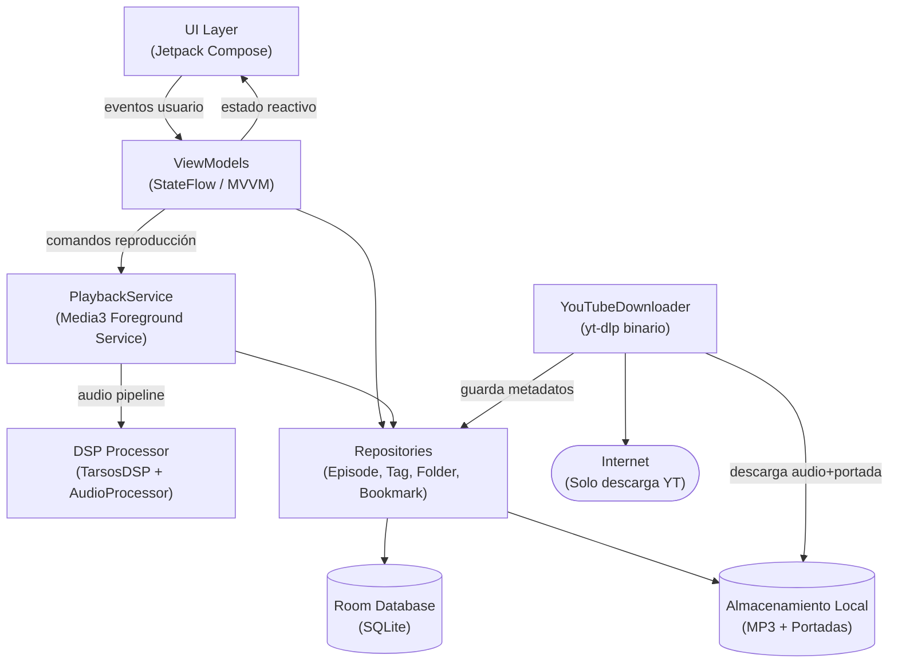

## 1. Resumen Ejecutivo

Este proyecto es una aplicación móvil Android de reproducción de podcasts completamente local (offline-first), orientada a usuarios que gestionan su propia biblioteca de archivos MP3 o que desean convertir vídeos de YouTube en audio para escucharlos como podcasts. La aplicación no requiere backend propio ni infraestructura cloud: toda la lógica, almacenamiento y procesamiento de audio ocurre en el dispositivo del usuario. La única excepción es la descarga de audio desde YouTube, que sí requiere conexión a internet puntual.

El enfoque recomendado es una **aplicación Android nativa con Kotlin + Jetpack Compose**, utilizando **ExoPlayer (Media3)** como motor de reproducción de audio, **SQLite vía Room** para la persistencia local de metadatos, etiquetas, carpetas y bookmarks, y **yt-dlp embebido o invocado mediante binario nativo** para la extracción de audio desde YouTube. Para el procesamiento de audio avanzado (reducción de ruido, ensalzamiento de voces, salto de silencios) se utilizará **TarsosDSP** o pipelines personalizados sobre **AudioTrack/MediaCodec** con filtros DSP. Este stack garantiza el máximo rendimiento nativo, acceso completo al sistema de archivos, soporte de notificaciones de reproducción en background, y plena compatibilidad con Android sin dependencias externas.

Los principales trade-offs son: (1) se elige desarrollo nativo Android en lugar de Flutter o React Native para tener acceso directo a las APIs de audio de bajo nivel necesarias para los efectos DSP, a costa de no tener versión iOS de forma inmediata; (2) la integración de yt-dlp en Android implica distribuir un binario nativo ARM que añade peso a la APK y complejidad legal; (3) los efectos de audio (especialmente reducción de ruido y ensalzamiento de voces) son computacionalmente costosos en tiempo real y pueden impactar la batería en dispositivos de gama baja.

El riesgo más crítico del proyecto es la **implementación de los efectos de audio en tiempo real** (DSP pipeline sobre el stream de ExoPlayer), ya que requiere conocimiento especializado de procesamiento de señal y la integración con ExoPlayer no es trivial. Un segundo riesgo relevante es el **mantenimiento de la integración con YouTube** (a través de yt-dlp), ya que YouTube cambia sus APIs con frecuencia y el binario debe actualizarse periódicamente.

---

## 2. Requisitos

### 2.1 Requisitos Funcionales

- **[MUST]** Reproducción de archivos MP3 locales con reproductor optimizado para podcast (play/pause, retroceso 30s, avance 10s, portada del archivo, barra de progreso).
- **[MUST]** Control de velocidad de reproducción (ej. 0.5x, 0.75x, 1x, 1.25x, 1.5x, 1.75x, 2x).
- **[MUST]** Sistema de bookmarks/marcadores con punto de inicio, punto de fin y nombre personalizado dentro de un episodio.
- **[MUST]** Etiquetado personalizado de archivos (tags/temas custom) y filtrado por etiqueta.
- **[MUST]** Organización de archivos en carpetas/colecciones personalizadas.
- **[MUST]** Importación de archivos MP3 desde el almacenamiento local del dispositivo.
- **[MUST]** Descarga de audio desde YouTube a partir de un enlace, guardándolo con portada y nombre original.
- **[MUST]** Modo de audio "Reducción de ruido" (modo exclusivo, no compatible simultáneamente con ensalzamiento de voces).
- **[MUST]** Modo de audio "Ensalzamiento de voces" (modo exclusivo, no compatible simultáneamente con reducción de ruido).
- **[MUST]** Efecto togglable "Saltar silencios/pausas" (compatible con cualquiera de los dos modos anteriores).
- **[MUST]** Reproducción en background con notificación de sistema (controles en la pantalla de bloqueo y barra de notificaciones).
- **[SHOULD]** Visualización de portada del podcast/episodio extraída de los metadatos ID3 del MP3 o descargada de YouTube.
- **[SHOULD]** Persistencia de la posición de reproducción por episodio (reanudar donde se dejó).
- **[SHOULD]** Búsqueda de archivos/episodios por nombre dentro de la biblioteca.
- **[SHOULD]** Soporte para listas de reproducción o colas de reproducción.
- **[NICE]** Soporte para otros formatos de audio además de MP3 (AAC, OGG, FLAC, M4A).
- **[NICE]** Exportar/importar bookmarks o configuración.
- **[NICE]** Estadísticas de escucha (tiempo total escuchado, episodios completados).
- **[NICE]** Tema oscuro / tema claro.

### 2.2 Requisitos No Funcionales

- **[MUST]** La aplicación debe funcionar completamente offline excepto la funcionalidad de descarga de YouTube.
- **[MUST]** Solo plataforma Android (no se requiere iOS en esta versión).
- **[MUST]** Sin infraestructura cloud propia: toda la lógica y datos residen en el dispositivo.
- **[MUST]** El procesamiento de audio (efectos DSP) debe aplicarse en tiempo real durante la reproducción sin cortes o latencia perceptible (< 150ms).
- **[MUST]** La app debe consumir una cantidad razonable de batería; los efectos DSP no deben incrementar el consumo más de un 30% respecto a la reproducción simple.
- **[SHOULD]** Tiempo de arranque de la app inferior a 2 segundos en dispositivos de gama media (Android 8+, 3GB RAM).
- **[SHOULD]** Compatibilidad mínima Android 8.0 (API 26) para llegar a >95% de dispositivos Android activos.
- **[SHOULD]** La base de datos local (Room/SQLite) debe soportar bibliotecas de hasta 5.000 episodios sin degradación notable.
- **[SHOULD]** La interfaz debe seguir las guías de Material Design 3 con elementos grandes y accesibles (botones táctiles mínimo 48dp).
- **[SHOULD]** Seguridad del almacenamiento: los archivos se almacenan en el espacio privado de la app o en carpetas designadas con los permisos adecuados.
- **[NICE]** Soporte para Android Auto (controles en el vehículo).
- **[NICE]** Accesibilidad: soporte TalkBack para usuarios con discapacidad visual.

---

## 3. Stack Tecnológico

### Lenguaje: Kotlin
- **Justificación**: Lenguaje oficial y moderno de Android, con soporte completo de coroutines para gestión de operaciones asíncronas (carga de archivos, procesamiento DSP, descarga YouTube) sin bloquear el hilo principal. Esencial para un desarrollo Android nativo de calidad.
- **Pros**:
  - Coroutines y Flow para operaciones asíncronas sin callback hell.
  - Interoperabilidad total con librerías Java (TarsosDSP, ExoPlayer).
  - Null safety reduce crashes en producción.
  - Amplio ecosistema de librerías Jetpack.
- **Contras**:
  - Curva de aprendizaje si el equipo viene de Java puro.
  - Tiempos de compilación algo superiores a Java.
- **Alternativas consideradas**: Java, Flutter/Dart, React Native.

---

### UI Framework: Jetpack Compose
- **Justificación**: Framework declarativo oficial de Android que permite construir la interfaz del reproductor (portada grande, botones grandes, barra de progreso, bottom sheet de efectos) con mucha menos verbosidad que XML, y con animaciones fluidas integradas. Ideal para una UI centrada en el reproductor multimedia.
- **Pros**:
  - Diseño declarativo: la UI refleja el estado del reproductor directamente.
  - Animaciones y transiciones de primer nivel.
  - Integración nativa con ViewModel y StateFlow.
  - Material Design 3 out of the box.
- **Contras**:
  - Rendimiento ligeramente inferior a Views para listas muy largas sin optimización.
  - Requiere Android Studio moderno y conocimiento de Compose.
- **Alternativas consideradas**: XML Views + ViewBinding, Flutter.

---

### Motor de Reproducción: Media3 / ExoPlayer
- **Justificación**: ExoPlayer (ahora Media3) es el estándar de facto para reproducción de audio/vídeo en Android. Soporta nativamente control de velocidad, salto de posición, notificaciones MediaSession, integración con pantalla de bloqueo y Android Auto, y permite insertar `AudioProcessor` personalizados en el pipeline para aplicar los efectos DSP requeridos.
- **Pros**:
  - `AudioProcessor` API permite inyectar efectos DSP en el pipeline de audio en tiempo real.
  - Soporte nativo de `MediaSession` para controles en notificación y pantalla de bloqueo.
  - Control de velocidad de reproducción nativo (`PlaybackParameters`).
  - Soporte de múltiples formatos: MP3, AAC, OGG, FLAC, M4A.
  - Mantenido por Google, amplia documentación.
- **Contras**:
  - La API de `AudioProcessor` es de bajo nivel y requiere trabajo significativo para implementar DSP.
  - La migración de ExoPlayer 2 a Media3 puede generar confusión en documentación.
- **Alternativas consideradas**: MediaPlayer (Android nativo, limitado), VLC for Android LibVLC.

---

### Procesamiento DSP: TarsosDSP + AudioProcessor personalizado
- **Justificación**: TarsosDSP es una librería Java de procesamiento de audio orientada a análisis y transformación en tiempo real, compatible con Android. Proporciona algoritmos para detección de silencios (para el "salto de silencios") y filtros de audio. Para reducción de ruido y ensalzamiento de voces se implementarán filtros de paso de banda y gates de ruido como `AudioProcessor` de Media3.
- **Pros**:
  - TarsosDSP funciona en Android sin NDK.
  - Algoritmos listos para detección de energía/silencios.
  - Integración mediante `AudioProcessor` de Media3 permite procesamiento inline.
  - No requiere conexión ni API externa.
- **Contras**:
  - La reducción de ruido de alta calidad (tipo RNNoise) requiere NDK/JNI o un modelo de ML.
  - El "ensalzamiento de voces" (EQ boost en frecuencias 300Hz-3kHz) es una aproximación, no IA real.
  - Posible impacto en batería en dispositivos de gama baja.
- **Alternativas consideradas**: RNNoise vía NDK (mayor calidad, mayor complejidad), WebRTC AudioProcessing Module (NDK), Oboe.

---

### Base de Datos Local: Room (SQLite)
- **Justificación**: Room es la capa de abstracción oficial de SQLite para Android. Almacenará los metadatos de episodios, etiquetas, relaciones episodio-etiqueta, carpetas, bookmarks y posiciones de reproducción. Es completamente local, sin coste, y soporta consultas complejas con Flow para reactividad en la UI.
- **Pros**:
  - Totalmente local y offline.
  - Soporte de Flow/LiveData para UI reactiva.
  - Migraciones de esquema estructuradas.
  - Queries tipadas y verificadas en compilación.
- **Contras**:
  - No es adecuado para almacenar archivos binarios grandes (los MP3 se almacenan en sistema de ficheros, no en Room).
  - Requiere diseño cuidadoso del esquema para relaciones many-to-many (episodio↔etiqueta).
- **Alternativas consideradas**: DataStore (solo key-value, insuficiente), Realm, SQLDelight.

---

### Descarga YouTube: yt-dlp (binario nativo ARM)
- **Justificación**: yt-dlp es la herramienta más robusta y actualizada para extracción de audio de YouTube. Se puede distribuir como binario nativo ARM dentro de la APK (en `assets/`) y ejecutarse mediante `ProcessBuilder` desde la app. Extrae el audio en MP3, la miniatura del vídeo como portada y el título como nombre de archivo, todo sin necesidad de API key.
- **Pros**:
  - Sin coste de API (YouTube Data API tiene cuotas limitadas y coste).
  - Extracción de thumbnail y título automática.
  - Comunidad activa que mantiene compatibilidad con cambios de YouTube.
  - Funciona con conexión puntual sin backend propio.
- **Contras**:
  - Los binarios ARM aumentan el tamaño de la APK (~15-30MB).
  - YouTube puede bloquear peticiones desde IPs o user-agents conocidos.
  - Requiere actualización periódica del binario cuando YouTube cambia su API interna.
  - Zona gris legal (ToS de YouTube).
  - Requiere permiso `INTERNET` en el manifest.
- **Alternativas consideradas**: NewPipe Extractor (librería Java, sin binario), youtube-dl (obsoleto respecto a yt-dlp).

---

### Gestión de dependencias y Build: Gradle (Kotlin DSL) + Android Studio
- **Justificación**: Herramienta estándar del ecosistema Android. El uso de Kotlin DSL para el build script mejora la type-safety y el autocompletado respecto a Groovy.
- **Pros**:
  - Estándar de facto, amplia documentación.
  - Gestión de variantes de build (debug/release).
  - Soporte de ABI splits para empaquetar binarios ARM solo para arquitecturas necesarias.
- **Contras**:
  - Tiempos de build lentos en proyectos grandes.
- **Alternativas consideradas**: Bazel (excesivo para este proyecto).

---

### Inyección de dependencias: Hilt (Dagger)
- **Justificación**: Hilt es el framework de DI recomendado por Google para Android. Permite inyectar repositorios, DAOs de Room y el servicio de reproducción de forma limpia, facilitando el testing.
- **Pros**:
  - Reduce boilerplate vs Dagger puro.
  - Integración con ViewModel y WorkManager.
  - Soporte oficial de Google.
- **Contras**:
  - Incrementa el tiempo de compilación.
- **Alternativas consideradas**: Koin (más simple, menos boilerplate pero menos rendimiento en proyectos grandes).

---

### CI/CD: GitHub Actions
- **Justificación**: El proyecto no tiene backend ni despliegue en servidor. GitHub Actions permite automatizar la compilación, tests instrumentados (en emulador) y generación de APK de release firmada sin coste para proyectos personales/pequeños.
- **Pros**:
  - Gratuito para repositorios públicos y suficiente para privados en plan básico.
  - Workflows YAML sencillos para proyectos Android.
  - Integración con GitHub Releases para distribuir APKs.
- **Contras**:
  - Los tests instrumentados en emulador son lentos en CI.
- **Alternativas consideradas**: Bitrise (especializado Android pero de pago), GitLab CI.

---

## 4. Arquitectura

### 4.1 Patrón Arquitectónico

Se adoptará una **arquitectura modular de capas (Clean Architecture simplificada)** dentro de un único proyecto Android (monolito modular). Los módulos serán: `:app` (UI + navegación), `:core:data` (Room, repositorios, acceso a ficheros), `:core:domain` (casos de uso, modelos de negocio), `:feature:player` (servicio de reproducción, DSP), `:feature:library` (gestión de biblioteca, etiquetas, carpetas), `:feature:youtube` (descarga y extracción).

Este enfoque está justificado porque: (1) el equipo presumiblemente es pequeño (1-3 personas), lo que hace los microservicios innecesarios; (2) toda la lógica es local, sin necesidad de comunicación entre servicios distribuidos; (3) la modularización mejora los tiempos de compilación incremental y la separación de responsabilidades sin añadir la complejidad operacional de múltiples procesos; (4) permite escalar añadiendo módulos de feature sin refactoring masivo.

El patrón de presentación será **MVVM con StateFlow**, siguiendo las guías oficiales de Android Architecture Components.

### 4.2 Componentes del Sistema

- **[PlayerScreen UI]** (Jetpack Compose): Pantalla principal del reproductor. Muestra portada, título, barra de progreso, botones de control y panel de efectos DSP. Se comunica con: PlayerViewModel.
- **[PlayerViewModel]** (ViewModel + StateFlow): Gestiona el estado de la UI del reproductor (posición, velocidad, efecto activo, bookmarks del episodio actual). Se comunica con: PlaybackService, BookmarkRepository.
- **[PlaybackService]** (Android Foreground Service + Media3 MediaSessionService): Servicio en foreground que gestiona la reproducción de audio, la sesión de medios (notificación, pantalla de bloqueo), y el pipeline DSP. Se comunica con: DSPProcessor, LibraryRepository.
- **[DSPProcessor]** (TarsosDSP + AudioProcessor de Media3): Módulo que implementa los tres efectos de audio (reducción de ruido, ensalzamiento de voces, salto de silencios) como `AudioProcessor` inyectados en el pipeline de ExoPlayer. Se comunica con: PlaybackService.
- **[LibraryScreen UI]** (Jetpack Compose): Pantalla de biblioteca con lista de episodios, filtros por etiqueta y navegación a carpetas. Se comunica con: LibraryViewModel.
- **[LibraryViewModel]** (ViewModel): Gestiona el estado de la biblioteca, filtros activos y operaciones de organización. Se comunica con: EpisodeRepository, TagRepository, FolderRepository.
- **[EpisodeRepository]** (Room DAOs + FileManager): Abstrae el acceso a metadatos de episodios en Room y a los archivos MP3 en el sistema de ficheros. Se comunica con: Room Database.
- **[Room Database]** (SQLite vía Room): Almacena episodios, etiquetas, relaciones episodio-etiqueta, carpetas, bookmarks y posiciones de reproducción. Se comunica con: todos los repositorios.
- **[YouTubeDownloader]** (ProcessBuilder + yt-dlp binario): Ejecuta el binario yt-dlp con el enlace proporcionado, descarga el audio en MP3 y la miniatura, y persiste el episodio en el repositorio. Se comunica con: EpisodeRepository, internet.
- **[FileManager]** (Android Storage APIs): Gestiona la importación de archivos MP3 desde el almacenamiento externo (SAF - Storage Access Framework), la lectura de metadatos ID3 y el almacenamiento en el directorio privado de la app. Se comunica con: EpisodeRepository.

### 4.3 Patrones de Diseño

- **Repository Pattern**: Desacopla la fuente de datos (Room + ficheros) de los ViewModels y casos de uso, permitiendo sustituir implementaciones en tests.
- **Observer / StateFlow**: El estado de reproducción y la biblioteca se exponen como `StateFlow` que la UI observa reactivamente, eliminando polling manual.
- **Strategy**: Los tres efectos DSP (reducción de ruido, ensalzamiento de voces, salto de silencios) se implementan como estrategias intercambiables de `AudioProcessor`, permitiendo activarlos/desactivarlos sin modificar el pipeline base.
- **Factory**: `DSPProcessorFactory` crea la combinación correcta de `AudioProcessor` según los efectos activos seleccionados por el usuario.
- **Facade**: `PlaybackService` actúa como fachada que simplifica la interacción con Media3, el DSPProcessor y la MediaSession frente al resto de la app.
- **Command**: Las acciones del reproductor (play, pause, seek, skip silence) se modelan como comandos, facilitando su invocación desde la notificación, la UI y (futuro) Android Auto.
- **Singleton (con DI)**: La instancia de Room Database y PlaybackService se gestionan como singletons a través de Hilt para garantizar una única fuente de verdad.

### 4.4 Diagrama de Arquitectura

### 4.5 Infraestructura

Al ser una aplicación **100% local sin backend**, la infraestructura se limita al dispositivo del usuario y al pipeline de distribución:

- **Almacenamiento en dispositivo**: Los archivos MP3 e imágenes de portada se almacenan en el directorio privado de la app (`context.filesDir` o `context.getExternalFilesDir()`) o mediante SAF (Storage Access Framework) para archivos importados desde ubicaciones externas. Room gestiona la BD SQLite en `context.getDatabasePath()`.
- **No hay servidor, CDN ni base de datos remota**: Cero infraestructura cloud propia.
- **Distribución de la APK**: GitHub Releases para distribución directa (sideload) o Google Play Store (requiere cuenta de desarrollador, $25 única vez). Para yt-dlp, los binarios ARM64 y ARMv7 se incluyen en `src/main/assets/` y se extraen al `filesDir` en el primer arranque.
- **Actualización de yt-dlp**: Se puede implementar un mecanismo de auto-actualización del binario yt-dlp desde GitHub Releases de yt-dlp cuando hay conexión disponible, sin actualizar toda la APK.
- **CI/CD con GitHub Actions**: Workflow que compila la APK en modo release, la firma con keystore almacenado como GitHub Secret, ejecuta tests unitarios y sube el artefacto a GitHub Releases automáticamente en cada tag.
- **Tamaño de APK**: Con ABI splits se generan APKs separadas por arquitectura (~15-20MB base + ~15MB por binario yt-dlp por ABI), reduciendo el tamaño descargado por usuario.

---

## 5. Riesgos y Mitigaciones

### ALTO Implementación de efectos DSP en tiempo real con ExoPlayer

- **Riesgo**: La API `AudioProcessor` de Media3/ExoPlayer opera sobre PCM de 16-bit o float en tiempo real. Implementar reducción de ruido (gate espectral o filtro adaptativo) y ensalzamiento de voces (EQ de paso de banda) con baja latencia y sin artefactos de audio es técnicamente complejo. Un procesamiento mal implementado puede causar cortes, artefactos (clipping, aliasing) o consumo excesivo de CPU que drene la batería o provoque ANR (Application Not Responding).
- **Mitigación**: Comenzar con implementaciones simples y probadas: reducción de ruido como noise gate (umbral de amplitud) + high-pass filter; ensalzamiento de voces como EQ boost en banda 300Hz-3kHz usando biquad filters de TarsosDSP. Usar benchmarks de `AudioProcessor` para medir el tiempo de procesamiento por buffer. Reservar el procesamiento en un hilo dedicado (`HandlerThread`). Como mejora futura, evaluar RNNoise compilado con NDK para reducción de ruido de mayor calidad.

---

### ALTO Mantenimiento de la integración con YouTube (yt-dlp)

- **Riesgo**: YouTube cambia sus mecanismos de extracción de URLs con frecuencia (2-4 veces al año). Si el binario yt-dlp incluido en la APK queda desactualizado, la funcionalidad de descarga dejará de funcionar para todos los usuarios sin necesidad de que la app falle en nada más.
- **Mitigación**: Implementar un sistema de auto-actualización del binario yt-dlp en segundo plano (mediante WorkManager) que compruebe la última versión en la API de GitHub Releases de yt-dlp y la descargue cuando hay WiFi. Mostrar al usuario un aviso claro cuando la descarga falla por versión desactualizada, con botón para forzar actualización del binario.

---

### ALTO Permisos de almacenamiento en Android 10+ (Scoped Storage)

- **Riesgo**: Android 10+ introdujo Scoped Storage que restringe el acceso libre al sistema de ficheros. El acceso a archivos MP3 del usuario fuera de los directorios de la app requiere el uso de SAF (Storage Access Framework) o `READ_MEDIA_AUDIO` (Android 13+), lo que complica la importación de archivos y la gestión de rutas persistentes.
- **Mitigación**: Usar SAF (`ActivityResultContracts.OpenDocument`) para importar archivos, tomando `persistableUriPermission` para mantener acceso permanente a las URIs seleccionadas. Copiar los archivos al directorio privado de la app en el momento de la importación para simplicidad operacional. Manejar los permisos `READ_MEDIA_AUDIO` en Android 13 y `READ_EXTERNAL_STORAGE` en versiones anteriores con graceful degradation.

---

### MEDIO Rendimiento del salto de silencios en tiempo real

- **Riesgo**: Detectar silencios en tiempo real analizando la energía del buffer de audio y hacer un seek automático puede introducir saltos perceptibles o falsos positivos (pausas naturales del hablante que se saltan incorrectamente), degradando la experiencia de escucha.
- **Mitigación**: Implementar un umbral de silencio configurable (duración mínima del silencio para saltar, por defecto ~800ms) y un pre-análisis en segundo plano del fichero para marcar segmentos de silencio antes de llegar a ellos (look-ahead buffer). Ofrecer al usuario un slider de sensibilidad del detector de silencios.

---

### MEDIO Aspectos legales de yt-dlp y ToS de YouTube

- **Riesgo**: Distribuir un binario que descarga contenido de YouTube puede infringir los Términos de Servicio de YouTube y potencialmente legislación de copyright dependiendo de la jurisdicción. Google Play puede rechazar la app o retirarla.
- **Mitigación**: Documentar claramente que la funcionalidad es para uso personal de contenido con licencia libre (podcasts, charlas Creative Commons). Evaluar distribución fuera de Google Play (sideload directo, F-Droid) donde las restricciones de ToS son menores. Considerar que la responsabilidad legal recae en el usuario (disclaimer en la app). Diseñar la app de forma que la funcionalidad YouTube sea un módulo opcional y desactivable.

---

### BAJO Tamaño de la APK por los binarios yt-dlp

- **Riesgo**: Incluir binarios yt-dlp para ARM64 y ARMv7 añade ~30MB a la APK, lo que puede disuadir descargas o ser rechazado por Google Play (límite de 150MB para APK base).
- **Mitigación**: Usar ABI splits en Gradle para generar APKs específicas por arquitectura. Publicar en Google Play mediante Android App Bundle (AAB), que entrega automáticamente solo el binario para la arquitectura del dispositivo. Alternativamente, descargar el binario yt-dlp en el primer uso en lugar de incluirlo en la APK.

---

## 6. Plan de Desarrollo

### Fase 1: Fundamentos y reproductor básico — 3-4 semanas

Establecer el esqueleto del proyecto, la arquitectura de capas, la base de datos Room con esquema inicial, y el reproductor de audio básico con ExoPlayer. Esta fase entrega el núcleo funcional de la app.

- Configuración del proyecto Android con Kotlin, Jetpack Compose, Hilt y Room.
- Esquema de Room: entidades Episode, Tag, Folder, Bookmark, PlaybackState.
- Importación de archivos MP3 desde almacenamiento local (SAF + permisos).
- Reproductor básico con Media3: play/pause, seek, skip ±30s/10s, velocidad, portada ID3, notificación de background.

### Fase 2: Biblioteca y organización — 2-3 semanas

Construir la pantalla de biblioteca con todas las funciones de organización. Depende de la Fase 1 (repositorios y Room deben estar operativos).

- UI de biblioteca con lista de episodios, búsqueda y navegación a carpetas.
- CRUD de etiquetas/tags y asignación a episodios (relación many-to-many en Room).
- Gestión de carpetas y asignación de episodios a carpetas.
- Sistema de bookmarks: crear, editar, eliminar, navegar a un bookmark desde el reproductor.

### Fase 3: Efectos DSP de audio — 3-4 semanas

Implementar los tres efectos de audio dentro del pipeline de Media3. Esta es la fase más técnicamente compleja y no depende de las fases anteriores en cuanto a código, pero sí requiere el reproductor de la Fase 1 operativo.

- Implementación del `AudioProcessor` base e integración en ExoPlayer/Media3.
- Efecto de salto de silencios (detección de energía + seek automático con look-ahead).
- Filtro de reducción de ruido (noise gate + high-pass biquad filter).
- Filtro de ensalzamiento de voces (EQ boost 300Hz-3kHz con biquad filter).
- UI de selección de efectos en el reproductor (modo exclusivo para ruido/voces + toggle silencio).

### Fase 4: Descarga desde YouTube — 2-3 semanas

Integrar yt-dlp como binario nativo para la descarga de audio desde YouTube. Depende de la Fase 1 (EpisodeRepository debe existir para persistir el episodio descargado).

- Extracción y preparación del binario yt-dlp en `assets/` con soporte ARM64/ARMv7.
- Ejecución controlada de yt-dlp via `ProcessBuilder` con parsing de salida y manejo de errores.
- Descarga de audio MP3 + thumbnail + metadatos (título, duración).
- UI de descarga (campo de URL, progress indicator, manejo de errores y permisos de red).
- Mecanismo de actualización del binario yt-dlp via WorkManager.

### Fase 5: Pulido, tests y distribución — 2 semanas

Refinar la experiencia de usuario, cubrir casos de borde, añadir tests y preparar la distribución. Depende de todas las fases anteriores.

- Tests unitarios de repositorios, ViewModels y AudioProcessor.
- Optimización de rendimiento (perfiles con Android Studio Profiler, reducción de consumo DSP).
- Persistencia de posición de reproducción y reanudación automática.
- Soporte de tema oscuro/claro.
- Configuración de GitHub Actions para build y firma automática de release APK/AAB.

---

## 7. Próximos Pasos

1. **Crear el repositorio GitHub y configurar el proyecto Android base**: Inicializar un proyecto en Android Studio con Kotlin, Jetpack Compose (BOM más reciente), Hilt, Room y Media3. Configurar el `build.gradle.kts` con todas las dependencias y el Kotlin DSL. Esto debe hacerse antes de cualquier otra tarea para que el equipo pueda trabajar en paralelo.

2. **Diseñar y crear el esquema de Room con datos de prueba**: Definir las entidades (`Episode`, `Tag`, `EpisodeTagCrossRef`, `Folder`, `Bookmark`, `PlaybackPosition`), sus DAOs con las queries necesarias (filtrar por tag, listar por carpeta, obtener bookmarks de un episodio), y poblar la base de datos con datos de prueba para desarrollo. Verificar que las relaciones many-to-many funcionan correctamente con un test unitario de Room en JVM.

3. **Implementar el reproductor básico con Media3 y el PlaybackService**: Crear el `MediaSessionService` con ExoPlayer, conectarlo a la UI mediante `MediaController`, verificar que la notificación aparece correctamente en background y que los controles de la pantalla de bloqueo funcionan. Probar play/pause, seek, skip y control de velocidad con un MP3 de prueba hardcodeado antes de conectar el repositorio.

4. **Prototipar el `AudioProcessor` de salto de silencios como prueba de concepto DSP**: Antes de invertir semanas en todos los efectos, implementar un `AudioProcessor` mínimo que detecte energía RMS por buffer y loguee cuándo habría saltado un silencio. Medir el impacto en CPU con el Android Studio CPU Profiler. Este prototipo validará la viabilidad técnica del enfoque DSP y revelará si se necesita NDK/JNI antes de comprometerse con TarsosDSP.

5. **Descargar y probar el binario yt-dlp en un dispositivo Android físico**: Obtener el binario `yt-dlp_arm64` de la página oficial de releases de yt-dlp, copiarlo manualmente a `/data/local/tmp/` mediante ADB, darle permisos de ejecución (`chmod +x`) y ejecutarlo desde el shell del dispositivo con un enlace de YouTube de prueba. Esto valida la viabilidad antes de escribir código de integración y descarta problemas de SELinux u otras restricciones del sistema.

6. **Implementar la importación de MP3 con SAF y lectura de metadatos ID3**: Crear el `FileManager` con `ActivityResultContracts.OpenDocument` filtrando `audio/*`, copiar el archivo al `filesDir` privado de la app, extraer metadatos ID3 (título, artista, portada embebida) usando la librería `mp3agic` o `MediaMetadataRetriever` nativo de Android, y persistir el `Episode` en Room. Probar con al menos 5 archivos MP3 diferentes (con y sin metadatos completos).

7. **Diseñar los wireframes de todas las pantallas en Figma o similar**: Con el stack técnico confirmado, el equipo de UI debe diseñar (o refinar basándose en la imagen de referencia adjunta) las pantallas: Biblioteca principal, Reproductor, Detalle de episodio (tags + bookmarks), Pantalla de descarga YouTube, y el bottom sheet de efectos DSP. Definir el sistema de colores, tipografía y espaciado antes de comenzar a implementar UI en Compose para evitar refactoring visual.

8. **Configurar el workflow de GitHub Actions para CI**: Crear el archivo `.github/workflows/android.yml` que ejecute `./gradlew test` (tests unitarios JVM) y `./gradlew assembleDebug` en cada push a `main`. Configurar adicionalmente un workflow de release que genere y firme la APK cuando se crea un tag `v*`, usando el keystore almacenado como GitHub Secret (`KEYSTORE_FILE`, `KEY_ALIAS`, `KEY_PASSWORD`). Esto garantiza builds reproducibles desde el primer día.