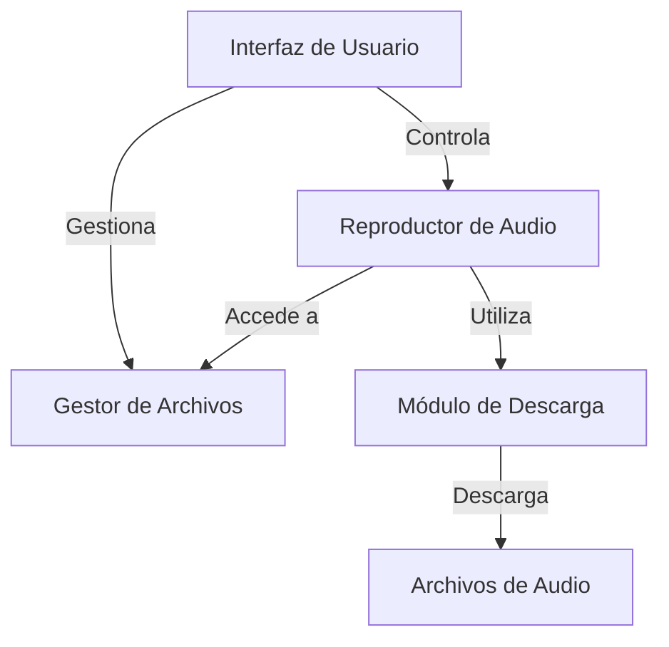

# 1. Resumen Ejecutivo
Aplicación móvil para reproducir podcasts enfocada en la descarga de archivos de audio y videos de YouTube, permitiendo el uso offline. La app es completamente local, sin necesidad de infraestructura en la nube.

# 2. Requisitos
## 2.1 Requisitos Funcionales
- La aplicación debe permitir la reproducción de archivos de audio en varios formatos, incluido .mp3.
- La aplicación debe incluir un reproductor de audio con botones grandes de play/pause, 30s adelante y 10s atrás.
- La aplicación debe permitir la descarga de audio de videos de YouTube y guardarlo en formato .mp3.
- La aplicación debe permitir controlar la velocidad de reproducción.
- La aplicación debe permitir establecer marcadores (bookmarks) en puntos específicos del podcast.
- La aplicación debe permitir organizar archivos mediante etiquetas personalizadas.
- La aplicación debe permitir organizar archivos en carpetas.
- La aplicación debe ofrecer tres modos de escucha: normal, reducción de ruido y ensalzamiento de voces, siendo capaz de aplicar dos de ellos a la vez.
- La aplicación debe permitir saltar silencios/pausas del hablador.
- La aplicación debe solicitar permisos necesarios para la descarga de archivos de YouTube.

## 2.2 Requisitos No Funcionales
- La aplicación debe ser completamente funcional sin conexión a Internet.
- La aplicación debe funcionar completamente en local, sin almacenamiento ni procesamiento en la nube.
- La aplicación debe ser intuitiva y fácil de usar.
- La aplicación debe soportar un bajo consumo de recursos del dispositivo.
- La aplicación debe contar con una interfaz estética y amigable, similar a aplicaciones de referencia.

# 3. Stack Tecnológico
### Categoría: Backend
- **Nombre:** FFmpeg  
  **Justificación:** FFmpeg se utilizará para la manipulación de audio y video, permitiendo la conversión y la descarga de archivos de YouTube en formato .mp3.  
  **Pros:** Amplia capacidad de manipulación de formatos multimedia, Gratuito y de código abierto  
  **Contras:** Puede requerir conocimientos avanzados para la integración, No siempre tiene la mejor documentación  
  **Alternativas:** LibXenon, GStreamer

### Categoría: Base de datos
- **Nombre:** SQLite  
  **Justificación:** SQLite es ideal para almacenar datos localmente en la aplicación sin necesidad de una conexión a internet y es extremadamente ligero.  
  **Pros:** Sin necesidad de configuración y fácil de usar, Ideal para aplicaciones móviles con almacenamiento local  
  **Contras:** Limitado para grandes volúmenes de datos, No es escalable en comparación con otros sistemas de gestión de bases de datos  
  **Alternativas:** Realm, Room Persistence Library (Android)

### Categoría: Frontend
- **Nombre:** Android Studio  
  **Justificación:** Android Studio es el entorno de desarrollo recomendado para crear aplicaciones nativas de Android, garantizando compatibilidad y acceso a las últimas funcionalidades de Android.  
  **Pros:** Ofrece herramientas completas para desarrollo de aplicaciones Android, Amplio soporte y comunidad  
  **Contras:** Requiere un sistema operativo compatible para su instalación, Puede ser pesado para equipos de bajo rendimiento  
  **Alternativas:** Kotlin Multiplatform Mobile (KMM), React Native

### Categoría: Auth
- **Nombre:** N/A  
  **Justificación:** No se requiere autenticación ya que la aplicación no gestionará datos en la nube ni usuarios, funcionando completamente en local.  
  **Pros:**  
  **Contras:**  
  **Alternativas:**  

### Categoría: Hosting/Despliegue
- **Nombre:** N/A  
  **Justificación:** La aplicación es completamente local, no requiere infraestructura de hosting.  
  **Pros:**  
  **Contras:**  
  **Alternativas:**  

### Categoría: CI/CD
- **Nombre:** GitHub Actions  
  **Justificación:** A pesar de que la aplicación no requiere despliegue en servidor, GitHub Actions puede ser útil para automatizar el proceso de pruebas y asegurar la calidad del código.  
  **Pros:** Integración continua fácil con repositorios de GitHub, Gratuito en la mayoría de los planes  
  **Contras:** Dependencia de GitHub para el alojamiento del código, Limitaciones en minutos de ejecución en planes gratuitos  
  **Alternativas:** Travis CI, GitLab CI

# 4. Arquitectura
## 4.1 Patrón Arquitectónico
- **Nombre:** Monolito modular  
  **Justificación:** El proyecto es una aplicación local sencilla, lo que hace que un enfoque monolítico modular sea suficiente y fácil de gestionar.

## 4.2 Componentes del Sistema
- **Reproductor de Audio:** 
  - **Tecnología:** Android Studio  
  - **Responsabilidad:** Permitir la reproducción de archivos de audio con controles intuitivos.  
  - **Comunicación con:** Gestor de Archivos, Módulo de Descarga

- **Gestor de Archivos:** 
  - **Tecnología:** SQLite  
  - **Responsabilidad:** Organizar y almacenar información sobre los archivos de audio y sus etiquetas.  
  - **Comunicación con:** Reproductor de Audio

- **Módulo de Descarga:** 
  - **Tecnología:** FFmpeg  
  - **Responsabilidad:** Descargar y convertir audio de YouTube a formato .mp3 y guardarlo localmente.  
  - **Comunicación con:** Reproductor de Audio

- **Interfaz de Usuario:** 
  - **Tecnología:** Android Studio  
  - **Responsabilidad:** Ofrecer una experiencia visual estandarizada y amigable al usuario.  
  - **Comunicación con:** Reproductor de Audio, Gestor de Archivos

## 4.3 Patrones de Diseño
- **MVC:** 
  **Justificación:** Este patrón asegura una buena separación entre la lógica de la aplicación, la interfaz de usuario y la gestión de datos.
- **Singleton:** 
  **Justificación:** Se puede usar para el gestor de archivos para asegurar que haya una única instancia que maneje los datos localmente.

## 4.4 Diagrama de Arquitectura

## 4.5 Infraestructura
La aplicación se desplegará en dispositivos Android y almacenará todos los archivos de audio y datos localmente usando SQLite, sin depender de servidores externos ni APIs pagadas, excepto para la conversión de YouTube que se procederá en local con FFmpeg.

# 5. Riesgos y Mitigaciones
- **Limitaciones de almacenamiento local:** 
  - **Descripción:** El almacenamiento limitado del dispositivo puede afectar la capacidad de la aplicación para guardar múltiples archivos de audio.  
  - **Mitigación:** Implementar una gestión eficiente del espacio que permita al usuario eliminar archivos innecesarios.

- **Compatibilidad con varios formatos de audio:** 
  - **Descripción:** La aplicación debe ser capaz de manejar varios formatos de audio, lo que puede ser complejo.  
  - **Mitigación:** Realizar pruebas exhaustivas y utilizar librerías populares y bien documentadas como FFmpeg.

- **Interfaz de usuario no intuitiva:** 
  - **Descripción:** La interfaz puede no ser clara para todos los usuarios, afectando la experiencia.  
  - **Mitigación:** Probar el diseño con un grupo de usuarios y ajustar según el feedback recibido.

# 6. Plan de Desarrollo
## Fase 1: Diseño de UI/UX
- **Duración:** 2 semanas  
- **Descripción:** Desarrollar un diseño intuitivo para la interfaz de usuario basándose en aplicaciones de referencia.  
- **Entregables:** Prototipo de la interfaz, Guía de usuario  
- **Dependencias:** ninguna

## Fase 2: Implementación del Reproductor
- **Duración:** 3 semanas  
- **Descripción:** Construir la funcionalidad del reproductor de audio con todos los controles necesarios.  
- **Entregables:** Código del reproductor, Pruebas de funcionalidad  
- **Dependencias:** Fase 1

## Fase 3: Desarrollo de Gestor de Archivos
- **Duración:** 2 semanas  
- **Descripción:** Implementar la gestión de archivos y etiquetas utilizando SQLite.  
- **Entregables:** Código del gestor de archivos, Pruebas de datos  
- **Dependencias:** Fase 2

## Fase 4: Módulo de Descarga de YouTube
- **Duración:** 2 semanas  
- **Descripción:** Desarrollar el módulo que descarga y convierte audio de YouTube.  
- **Entregables:** Código del módulo de descarga, Pruebas de descargas  
- **Dependencias:** Fase 3

## Fase 5: Pruebas y Ajustes Finales
- **Duración:** 2 semanas  
- **Descripción:** Realizar pruebas completas y ajustar funciones según el feedback de usuarios.  
- **Entregables:** Informe de pruebas, Versión final de la app  
- **Dependencias:** Fase 4

# 7. Próximos Pasos
- Comenzar la fase 1 del desarrollo, que consiste en diseñar la interfaz de usuario y UX.