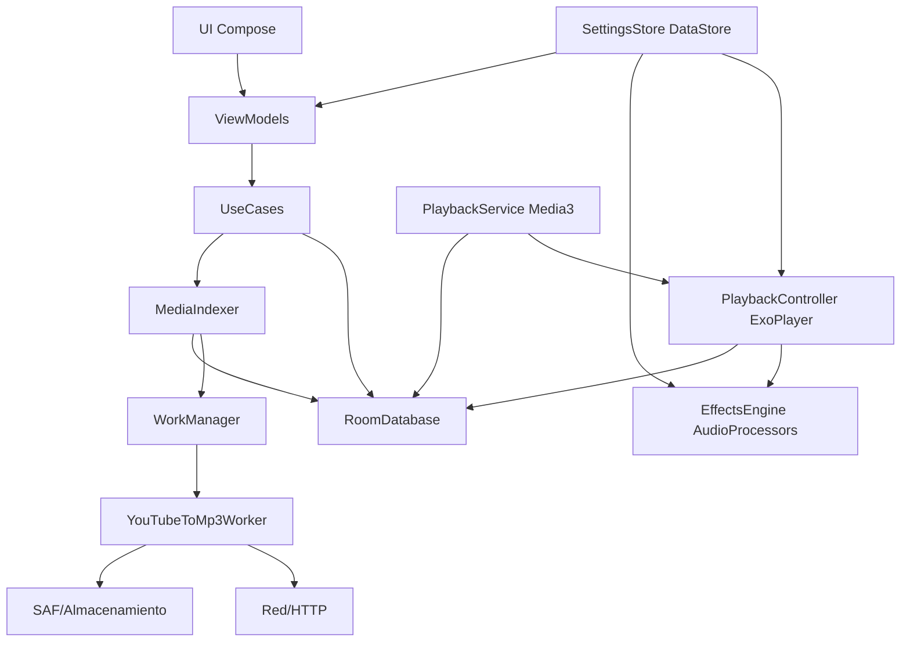

## 1. Resumen Ejecutivo
App Android nativa para escuchar “podcasts”/audios locales (principalmente MP3) sin duplicar archivos dentro de la app: la app indexa y reproduce desde el almacenamiento del dispositivo mediante URIs (MediaStore/SAF). Incluye un reproductor cómodo tipo podcast (botones grandes, saltos +30s/-10s, velocidad, carátula), persistencia de progreso, marcadores por rango (inicio/fin con nombre), organización por etiquetas y por carpetas, reproducción en segundo plano con controles del sistema (lockscreen/notificación), auriculares/Bluetooth y compatibilidad con Android Auto.

Como módulos avanzados: efectos de audio on-device (reducción de ruido, realce de voz y salto de silencios con reglas de exclusión/compatibilidad) y una función opcional de “YouTube → MP3” para descargar y convertir audio en el propio dispositivo (con riesgos de mantenimiento/políticas; se propone aislarla por flavors).

## 2. Requisitos
### 2.1 Requisitos Funcionales
- MUST: Reproducir archivos de audio locales (mínimo .mp3) seleccionados desde el almacenamiento del dispositivo sin duplicarlos dentro de la app (lectura por URI/MediaStore).
- MUST: Pantalla de reproductor tipo podcast con play/pausa, salto +30s y -10s, barra de progreso con seek, carátula/imagen, título y duración.
- MUST: Persistir y restaurar automáticamente la posición de reproducción por archivo (continuar donde se dejó) incluso tras cerrar la app o reiniciar.
- MUST: Reproducción en segundo plano con notificación multimedia y controles en lockscreen.
- MUST: Controles con auriculares cableados/Bluetooth (play/pausa, siguiente/anterior si aplica) y manejo de interrupciones (audio focus, llamadas, etc.).
- MUST: Integración con Android Auto (MediaBrowser/MediaSession) para navegación y control de reproducción.
- MUST: Ajuste de velocidad de reproducción (p. ej. 0.5x–3.0x) y recordar preferencia global y/o por archivo.
- MUST: Marcadores/bookmarks con nombre y rango (inicio y fin) dentro de un audio; listar, editar y borrar.
- MUST: Organización por etiquetas (tags) personalizadas: crear/renombrar/borrar, asignar/quitar a audios y filtrar.
- MUST: Organización/filtrado por carpetas del dispositivo (vista por directorios) y/o por colecciones definidas por el usuario basadas en rutas.
- MUST: Importar/añadir audios mediante selector de documentos (SAF) y/o escaneo de MediaStore, gestionando permisos compatibles con Scoped Storage.
- MUST: Extraer y mostrar metadatos (título, artista si existe) y carátula embebida (ID3) cuando esté disponible.
- MUST: Efecto “Saltar silencios/pausas” activable/desactivable durante reproducción.
- MUST: Dos modos excluyentes entre sí: (1) reducción de ruido y (2) realce de voces; conmutables y desactivables.
- MUST: Permitir combinar “Saltar silencios” con uno de los modos (ruido o voz) o con modo normal; los dos modos excluyentes no pueden aplicarse a la vez.
- SHOULD: Varios niveles/opciones por efecto (baja/media/alta) y preajustes; on-device; latencia aceptable.
- SHOULD: “YouTube a MP3”: pegar URL, obtener audio, descargar y guardar como archivo en el dispositivo, registrándolo en la biblioteca con nombre y carátula.
- SHOULD: Elegir carpeta de destino para descargas y gestionar permisos persistentes de lectura/escritura mediante SAF.
- SHOULD: Progreso, cancelación y manejo de errores para descarga y conversión.
- SHOULD: Búsqueda en biblioteca (nombre, tag, carpeta) y ordenación (recientes, alfabético, duración).
- SHOULD: Cola de reproducción/playlist local y reproducción continua.
- NICE: Exportar/importar base de datos local (tags, marcadores, progreso) para backup manual sin subir audios.
- NICE: Soportar más formatos (m4a/aac/ogg/flac) si el motor lo permite.

### 2.2 Requisitos No Funcionales
- MUST: Funcionamiento totalmente offline para reproducción/gestión de biblioteca; solo YouTube puede requerir conexión.
- MUST: No duplicar audios al añadirlos; almacenar solo referencias (URI/ruta), metadatos indexados y datos de usuario (tags, marcadores, progreso).
- MUST: Cumplir Scoped Storage (Android 10+) usando MediaStore/SAF y permisos persistentes; evitar permisos obsoletos.
- MUST: Reproducción robusta ante rotación, cambios de app, interrupciones de audio focus; recuperación segura tras crash (progreso persistente).
- MUST: Rendimiento fluido en gama media; operaciones pesadas (escaneo, carátulas, descargas/conversión) en segundo plano.
- MUST: Efectos on-device con recursos/modelos totales <= 5 GB; sin backend propio.
- MUST: Privacidad: no enviar biblioteca/reproducción a servidores propios; telemetría desactivada por defecto si existe.
- SHOULD: Bajo consumo de batería; uso eficiente de wakelocks y foreground service solo cuando corresponda.
- SHOULD: Accesibilidad (botones grandes, TalkBack, contraste, tipografía escalable).
- SHOULD: Compatibilidad mínima Android 8.0+ (API 26+) recomendado por foreground services/Auto; idealmente ampliar si no rompe requisitos.
- SHOULD: Observabilidad local (logging controlable y pantalla de diagnóstico).
- NICE: Arquitectura modular para aislar YouTube→MP3 y DSP para sustituirlos en el futuro.

## 3. Stack Tecnológico
### Frontend: Android nativo con Kotlin + Jetpack Compose
**Justificación:** Solo Android en V1; Compose permite iteración rápida de pantallas (biblioteca, reproductor, filtros, ajustes).
**Pros:** UI declarativa; integración Jetpack moderna.
**Contras:** Curva si venís de XML; algunos recursos legacy.
**Alternativas:** XML Views + Material; Flutter (si algún día iOS).

### Arquitectura (app): MVVM + Clean Architecture ligera (UseCases) + Coroutines/Flow
**Justificación:** Separa dominio (tags, marcadores, progreso) de infraestructura (Media3, SAF, Room) y gestiona concurrencia.
**Pros:** Testeable; mantenible.
**Contras:** Más boilerplate.
**Alternativas:** MVI; MVVM simple sin capa de dominio.

### Reproducción multimedia: AndroidX Media3 (ExoPlayer) + MediaSession/MediaLibraryService
**Justificación:** Estándar actual para background playback, audio focus, notificación, Bluetooth y Android Auto.
**Pros:** Robusto; velocidad/pitch; integración Auto.
**Contras:** Integración MediaSession/Auto tiene complejidad.
**Alternativas:** ExoPlayer legacy; MediaPlayer/AudioTrack (más trabajo).

### Persistencia: Room (SQLite)
**Justificación:** Guardar biblioteca indexada (URIs), progreso, tags (N:M), marcadores por rango, fuentes de carpetas, descargas.
**Pros:** Migraciones; consultas; Flow.
**Contras:** Hay que diseñar esquema/migraciones.
**Alternativas:** Realm Kotlin; SQLDelight.

### Preferencias: Jetpack DataStore (Preferences)
**Justificación:** Ajustes: velocidad por defecto, saltos, presets de efectos, carpeta destino YouTube.
**Pros:** Asíncrono; seguro.
**Contras:** No sustituye BBDD.
**Alternativas:** SharedPreferences; Proto DataStore.

### Archivos y permisos: MediaStore + Storage Access Framework (DocumentFile)
**Justificación:** Leer sin duplicar y gestionar Scoped Storage; selección de archivos/carpetas con permisos persistentes.
**Pros:** Compatible Android moderno; permisos persistentes.
**Contras:** Complejidad de URIs; I/O a veces más lento.
**Alternativas:** Rutas directas (problemático en Android 10+); solo MediaStore.

### DSP (base): Cadena de AudioProcessor (Media3) + lógica en Kotlin
**Justificación:** Punto natural para aplicar procesado en PCM durante reproducción sin backend.
**Pros:** Integración relativamente limpia con ExoPlayer.
**Contras:** DSP avanzado requiere cuidado (latencia/CPU).
**Alternativas:** AudioSink custom; AudioTrack/AAudio directo.

### DSP avanzado: RNNoise (NDK/JNI) y/o WebRTC Audio Processing Module (APM)
**Justificación:** Reducción de ruido/realce de voz de nivel intermedio-alto, ligero (<< 5 GB), ejecutable on-device.
**Pros:** Buen equilibrio calidad/tamaño; sin red.
**Contras:** Integración NDK/JNI y ajuste consume tiempo.
**Alternativas:** ONNX Runtime Mobile con modelos pequeños; SDKs comerciales (Superpowered/Dolby).

### YouTube → MP3 (opcional): yt-dlp embebido + ffmpeg-kit (on-device) + WorkManager
**Justificación:** Evitar API externa “fiable” (difícil de garantizar). Pipeline local descarga+transcodificación.
**Pros:** Autonomía; salida consistente MP3.
**Contras:** Se rompe con cambios de YouTube; aumenta tamaño/ABIs; riesgo de políticas en Play.
**Alternativas:** API de terceros (dependencia/coste); sacar del MVP; distribución fuera de Play.

### Trabajo en segundo plano: WorkManager
**Justificación:** Indexado/escaneo, descargas y conversiones largas con resiliencia.
**Pros:** Reintentos; constraints; integración OS.
**Contras:** No es tiempo real estricto.
**Alternativas:** ForegroundService dedicado (para descargas), JobScheduler directo.

### Distribución/Despliegue: Google Play Console (y/o sideload)
**Justificación:** No hay servidor; el despliegue es AAB/APK.
**Pros:** Tracks de testing; rollouts.
**Contras:** Políticas (especialmente YouTube).
**Alternativas:** APK directo; F-Droid/self-host.

### CI/CD y calidad: GitHub Actions + Gradle + Fastlane; Detekt/ktlint/Android Lint; JUnit/Espresso
**Justificación:** Reducir regresiones en permisos, background playback y BBDD.
**Pros:** Automatización; consistencia.
**Contras:** Setup inicial; tests instrumentados frágiles si no se cuidan.
**Alternativas:** Bitrise; GitLab CI; SonarQube.

## 4. Arquitectura
### 4.1 Patrón Arquitectónico
**Monolito modular on-device (Android) con Clean Architecture ligera + MVVM.**
No hay backend; la complejidad está en reproducción, indexado local, permisos y DSP. Se recomienda modularizar por features (módulos Gradle) para aislar YouTube→MP3 y EffectsEngine.

### 4.2 Componentes del Sistema
- **UI App (Compose):** Biblioteca, Reproductor, Tags/Marcadores, Ajustes, Importación/Carpetas, Descargas YouTube.
- **ViewModels:** Estado de UI y orquestación con Coroutines/Flow.
- **UseCases (Dominio):** Reglas de negocio (tags, marcadores por rango, progreso, filtros, catálogo Android Auto).
- **PlaybackService (MediaLibraryService):** Servicio en primer plano con MediaSession; browsing para Android Auto.
- **PlaybackController (ExoPlayer):** Control de reproducción, cola, velocidad, saltos, reporting de progreso.
- **EffectsEngine:** Cadena de AudioProcessors + JNI (RNNoise/WebRTC APM) + skip-silence; aplica reglas (A o B excluyentes; C combinable).
- **RoomDatabase:** AudioItem, PlaybackState, Tag, AudioTag, Bookmark, FolderSource, DownloadItem.
- **MediaIndexer:** Importación por SAF, indexado por Tree URI (carpetas) y/o MediaStore; reconciliación de URIs; ejecuta en WorkManager.
- **SettingsStore (DataStore):** Preferencias globales y presets.
- **YouTubeToMp3Worker:** Descarga/conversión/guardado por SAF con progreso y cancelación.

### 4.3 Patrones de Diseño
- **MVVM** para UI/estado.
- **Clean Architecture ligera (UseCases)** para aislar dominio.
- **Repository** para unificar acceso a Room/MediaStore/SAF.
- **Foreground Service + MediaSession** para background + Auto.
- **Strategy** para pipelines de efectos (Normal/Noise/Voice + SkipSilence).
- **Worker/Job pattern** para tareas largas (indexado/descargas/transcodificación).

### 4.4 Diagrama de Arquitectura

### 4.5 Infraestructura
- **100% on-device:** sin cloud, sin servidor.
- **Reproducción:** Media3 en un **MediaLibraryService**; se ejecuta como **foreground service** solo durante playback activo.
- **Persistencia:** Room (SQLite) + DataStore.
- **Archivos:** acceso por MediaStore y SAF con `takePersistableUriPermission` para URIs de archivo y Tree URIs de carpetas.
- **Tareas pesadas:** WorkManager.
- **YouTube→MP3 (opcional):** módulo local con yt-dlp + ffmpeg-kit por ABI (priorizar arm64-v8a). Propuesta de **flavors**:
  - **playSafe:** sin yt-dlp/ffmpeg (o solo importar audio ya descargado).
  - **full:** con yt-dlp+ffmpeg para distribución alternativa fuera de Play si fuese necesario.

## 5. Riesgos y Mitigaciones
- **ALTO — Integración DSP en pipeline Media3:**
  - *Riesgo:* latencia/CPU/estabilidad al insertar reducción de ruido/realce/skip-silence.
  - *Mitigación:* POC temprano con AudioProcessor chain sobre PCM; RNNoise/WebRTC APM vía JNI; presets (bajo/medio/alto); pruebas en 3 gamas de dispositivo; profiling.
- **ALTO — YouTube→MP3 frágil y políticas de distribución:**
  - *Riesgo:* roturas por cambios de YouTube; posible rechazo en Play.
  - *Mitigación:* módulo desacoplado + flavors; feature flags; en Play actualizar por releases; para “full” distribución alternativa.
- **MEDIO — Scoped Storage/SAF y URIs inválidas:**
  - *Riesgo:* archivos movidos/eliminados o permisos revocados.
  - *Mitigación:* indexado por carpetas (Tree URI) + verificación periódica; marcar inaccesibles y permitir “relink”; guardar metadatos auxiliares (nombre/tamaño/duración/huella).
- **MEDIO — Skip-silence y coherencia de marcadores/posición:**
  - *Riesgo:* si se altera el timeline, marcadores se desalinean.
  - *Mitigación:* implementar como supresión/compresión de frames silenciosos sin cambiar el timeline del Player; opción de sensibilidad y mínimo de silencio.
- **MEDIO — Batería/temperatura con DSP:**
  - *Mitigación:* límites de CPU, downmix opcional, sample rate menor para efectos si es aceptable, auto-desactivar con batería baja.
- **BAJO — Catálogo Android Auto lento/pobre:**
  - *Mitigación:* árbol simple (Continuar/Recientes/Tags/Carpetas), cacheo y consultas eficientes.

## 6. Plan de Desarrollo
- **Fase 1 (2–3 semanas): Base de reproducción y servicio multimedia**
  - Media3 + MediaLibraryService, notificación, audio focus, controles auriculares/Bluetooth, persistencia básica de progreso/velocidad.
- **Fase 2 (2–3 semanas): Biblioteca local, permisos y carpetas**
  - Importación SAF, selección de carpetas (Tree URI), indexado/reindexado con WorkManager, metadatos ID3 y carátulas, vista biblioteca + búsqueda básica.
- **Fase 3 (2 semanas): Tags y marcadores por rango**
  - CRUD tags, relación N:M, filtrado; bookmarks inicio/fin/nombre con integración en reproductor.
- **Fase 4 (1–2 semanas): Android Auto**
  - Exponer catálogo y browse/play desde Auto; MediaItems estables; pruebas en emulador.
- **Fase 5 (3–5 semanas): Efectos DSP (de POC a producto)**
  - Skip-silence + reducción de ruido + realce de voz, presets, reglas de exclusión, persistencia, benchmarks.
- **Fase 6 (2–4 semanas): YouTube→MP3 (módulo opcional + flavors)**
  - Worker descarga+conversión, progreso/cancelación, guardado por SAF, documentación de limitaciones de distribución.

## 7. Próximos Pasos
1) Cerrar definición de “carpetas”: navegación por rutas vs “fuentes” seleccionadas (Tree URI) y cómo se muestra en biblioteca.
2) Decidir alcance del MVP: recomendar MVP = reproducción + biblioteca + progreso + tags + bookmarks; dejar DSP avanzado y YouTube como fases posteriores si se quiere iterar rápido.
3) Hacer un POC técnico de **EffectsEngine** (AudioProcessor + RNNoise/WebRTC APM) en 1–2 semanas para validar viabilidad real en dispositivos.
4) Definir estrategia de distribución para YouTube→MP3 (PlaySafe vs Full) según dónde se vaya a publicar.
5) Diseñar esquema Room definitivo y migraciones iniciales (AudioItem, PlaybackState, Tag/AudioTag, Bookmark, FolderSource, DownloadItem).
